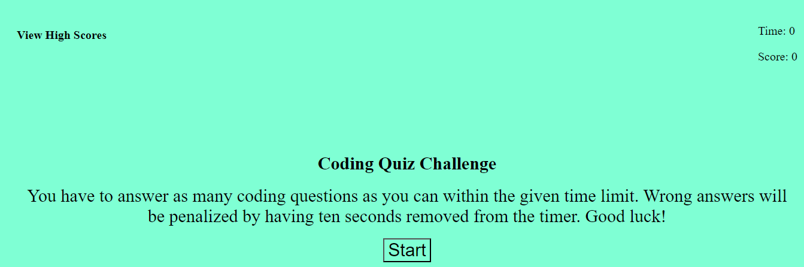

# Code Quiz
Timed quiz about coding

## Description

The purpose of this Coding Quiz Project is to allow bootcamp students to further their skills of creating a page from scratch while also applying skills learned about the DOM. Students have to use the DOM in Javascript to make edits to the page and grab certain elements to use in event listeners, providing functionality to the page while also making changes that are not already in the html and css. 

## Installation

N/A

## Usage

This website functions as a multiple choice quiz with 6 total questions. The user has to answer all the questions under a time limit of one minute. After pressing the start button, the first question and set of answers will appear. After answering each question, it will tell the user whether they got it right or wrong. Correct answers will gain them points, while incorrect answers will deduct 10 seconds from the timer. After answering all the questions, or the timer runs out, the user's points, which was calculated during the quiz, will also appear in the center with a text box, allowing them to log their score on a high scores page along with their initials. 

Live Site:

<a href="https://github.com/elvislau74/code-quiz">Click here for the GitHub Repository</a>

<a href="https://elvislau74.github.io/code-quiz/">Click here for the Live Site</a>

## Credits

N/A

## License

Please refer to the LICENSE in the repo.
